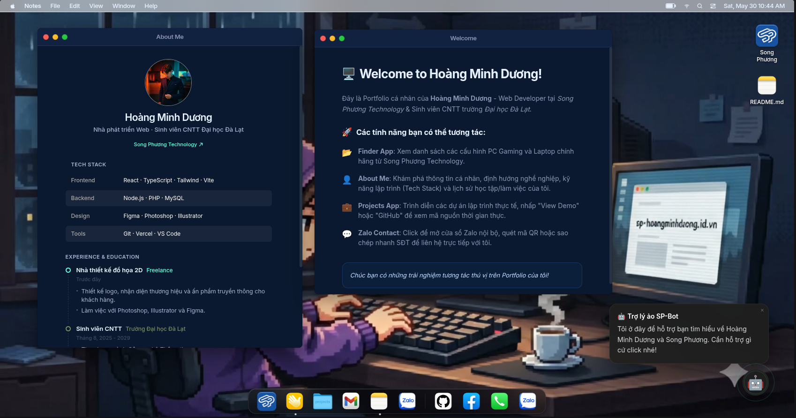

# Portfolio macOS

Portfolio cá nhân của Hoàng Minh Dương, được thiết kế như một desktop macOS thu nhỏ. Thay vì một landing page tĩnh, trang web hoạt động như một hệ điều hành portfolio: có Dock, Menu Bar, cửa sổ ứng dụng, Finder sản phẩm, About Me, Projects, Mail/Zalo contact và chatbot hỗ trợ.

Dữ liệu hiển thị được quản lý qua admin panel và lưu trong Neon PostgreSQL. Frontend dùng React/Vite, API chạy bằng serverless functions để phù hợp triển khai trên Vercel.

## Tính năng chính

- Desktop UI phong cách macOS với Window, Dock, Menu Bar và wallpaper tùy chỉnh.
- Giao diện mobile dạng iOS/Bento, tối ưu cho màn hình nhỏ.
- About Me lấy dữ liệu profile, timeline và tech stack từ database.
- Finder hiển thị danh mục sản phẩm Song Phương Technology.
- Projects quản lý dự án theo nhóm code, design và tools.
- Mascot chatbot dùng danh sách Q&A có thể cập nhật từ admin.
- Admin panel để chỉnh profile, products, projects, timeline, chatbot, appearance và SEO.
- Cache và deduplication ở service layer để giảm request trùng và hạn chế chớp loading.
- Serverless API kết nối Neon PostgreSQL, có xác thực admin bằng JWT.

## Tech Stack

- React 19
- TypeScript
- Vite 6
- Tailwind CSS
- Zustand
- Lucide React
- Swiper
- Neon PostgreSQL
- Vercel Serverless Functions
- bcryptjs, jose

## Cấu trúc dự án

```text
.
├── api/                  # Serverless API cho client và admin
├── database/             # Schema, seed và script tạo admin
├── docs/                 # Tài liệu deploy, database, Neon/Vercel
├── public/               # Ảnh brand, profile, contact, products, wallpapers
├── src/
│   ├── admin/            # Admin panel
│   ├── apps/             # About, Finder, Projects, Mail, Zalo, Welcome
│   ├── assets/           # App icons và asset build-time
│   ├── components/       # Desktop/mobile UI components
│   ├── services/         # API services, cache, pending request dedupe
│   ├── store/            # Zustand OS state
│   └── types/            # Kiểu dữ liệu dùng chung
├── vercel.json
└── package.json
```

## Chạy local

Yêu cầu Node.js `>=20.0.0`.

```bash
npm install
cp .env.example .env
npm run dev
```

Các biến môi trường chính:

```env
DATABASE_URL=postgres://...
JWT_SECRET=your-secret
FRONTEND_URL=http://localhost:5173
NODE_ENV=development
```

Build production:

```bash
npm run build
npm run preview
```

## Database

Database dùng Neon PostgreSQL. Các file chính:

- `database/schema.sql`: tạo bảng.
- `database/seed.sql`: dữ liệu khởi tạo.
- `database/create-admin.js`: tạo tài khoản admin.
- `database/migration_socials_v2.sql`: migration cho social links.

Tạo admin:

```bash
node database/create-admin.js <username> <password>
```

## Admin Panel

Admin panel nằm ở route `/admin`.

Các nhóm quản trị chính:

- Dashboard tổng quan.
- Profile, timeline và tech stack.
- Products cho Finder/Song Phương.
- Projects portfolio.
- Chatbot Q&A.
- Appearance, wallpaper và widget mobile.
- SEO metadata.

Sau khi lưu dữ liệu, client nhận event cập nhật để refresh cache và đồng bộ lại giao diện.

## API

`api/index.ts` xử lý các endpoint public và admin:

- Public: profile, timeline, products, projects, social links, chatbot, SEO.
- Admin: đăng nhập, CRUD nội dung, upload/setting và đồng bộ dữ liệu.

Admin API dùng token lưu ở client sau đăng nhập. Không commit `.env` hoặc thông tin đăng nhập thật.

## Deploy

Dự án đã cấu hình sẵn cho Vercel qua `vercel.json`.

Luồng deploy đề xuất:

1. Tạo Neon database.
2. Chạy `database/schema.sql`.
3. Seed dữ liệu nếu cần bằng `database/seed.sql`.
4. Tạo admin bằng `database/create-admin.js`.
5. Cấu hình biến môi trường trên Vercel.
6. Deploy project.

Tài liệu chi tiết nằm trong [docs/vercel-neon-setup.md](docs/vercel-neon-setup.md).

## Ghi chú phát triển

- Dùng `npm run build` trước khi deploy để kiểm tra TypeScript và bundle.
- Các service trong `src/services/` đã có cache RAM và pending request dedupe.
- Asset tĩnh nên đặt theo nhóm trong `public/images/`.
- Không đưa credential thật vào README, docs hoặc commit history.
