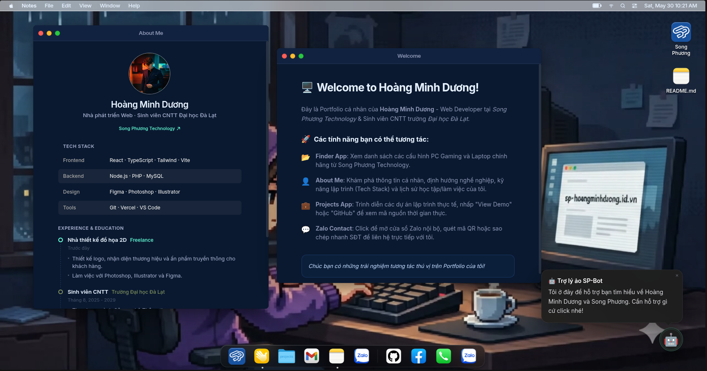

# Portfolio Minimalist

## Giới thiệu

Đây là một dự án portfolio cá nhân tối giản xây dựng bằng React + Vite + Tailwind CSS. Dự án bao gồm:

- Ứng dụng client React hiển thị thông tin hồ sơ, dự án, sản phẩm và liên hệ.
- Admin dashboard để quản lý nội dung profile, sản phẩm và mạng xã hội.
- API serverless (`api/`) xử lý dữ liệu và xác thực.
- Database mẫu với Neon Serverless.


## Công nghệ chính

- React 19
- Vite 6
- TypeScript
- Tailwind CSS 3
- Node.js 20.x
- @vercel/node cho serverless functions
- @neondatabase/serverless cho kết nối database
- bcryptjs và jose cho xác thực
- Zustand cho state management
- Swiper cho carousel/slide

## Cấu trúc thư mục chính

- `src/` - mã nguồn client React
  - `apps/` - các trang chính của portfolio
  - `components/` - thành phần giao diện desktop và mobile
  - `admin/` - giao diện quản trị và API admin
  - `services/` - logic gọi API và xử lý dữ liệu
  - `store/` - Zustand store quản lý trạng thái OS
- `api/` - endpoint serverless cho website
- `database/` - script tạo dữ liệu mẫu và schema
- `public/` - tài nguyên tĩnh
- `vercel.json` - cấu hình triển khai Vercel

## Cài đặt

1. Cài đặt phụ thuộc:

```bash
npm install
```

2. Tạo file cấu hình môi trường từ mẫu:

```bash
cp .env.example .env
```

3. Chỉnh sửa giá trị trong `.env` theo thông tin database và bí mật của bạn.

## Chạy dự án

- Chạy môi trường phát triển:

```bash
npm run dev
```

- Xây dựng production:

```bash
npm run build
```

- Chạy thử bản build:

```bash
npm run preview
```

## Cấu hình Node.js

Dự án yêu cầu Node.js `20.x`.

`package.json` đã thêm:

```json
"engines": {
  "node": "20.x"
}
```

## Admin dashboard

- Giao diện admin nằm trong `src/admin/`.
- Bao gồm:
  - `LoginPage.tsx` để đăng nhập
  - `ProductsEditor.tsx` để quản lý sản phẩm
  - `ProfileEditor.tsx` để cập nhật thông tin hồ sơ
  - `SocialEditor.tsx` để quản lý liên kết mạng xã hội

## API và database

- `api/` chứa các endpoint serverless cho dữ liệu profile, sản phẩm, project và social.
- `database/schema.sql` định nghĩa cấu trúc bảng.
- `database/seed.sql` tạo dữ liệu mẫu.
- `database/create-admin.js` tạo tài khoản admin mẫu.

## Triển khai

Dự án đã cấu hình để triển khai trên Vercel với `vercel.json` và runtime functions:

```json
"functions": {
  "api/**/*.ts": {
    "runtime": "@vercel/node@3.1.0"
  }
}
```

## Ghi chú

- Nếu bạn muốn dùng database mới, cập nhật biến môi trường và chạy lại script seed.
- Kiểm tra kỹ file `.env` trước khi deploy để bảo mật thông tin.

---

Nếu cần, bạn có thể mở rộng README bằng các hướng dẫn cấu hình chi tiết hơn cho từng bước deploy, login admin, hoặc cách phát triển thêm các trang mới.